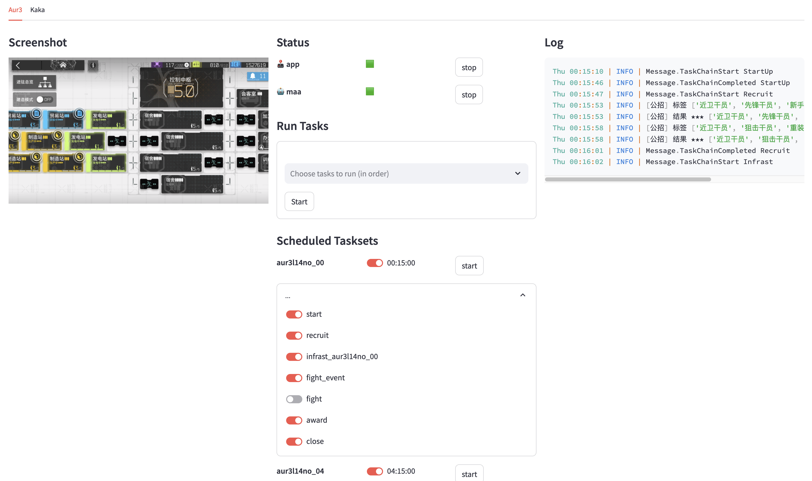

# maa-streamlit

Yet another maa frontend built with streamlit.

## Quick Start

1. Install dependencies using poetry.
2. Fill in config files. You may use `config_example` as reference.
   Note that config is similar but nonetheless **different** from that of maa-cli. Please see next section for details.

### Functions

1. Run Tasks: Run tasks in order, only if no maa instance is running.
2. Scheduled Taskset: Run taskset at specific time of day. Currently only HH:MM is supported. More complex conditions are not implemented (PR welcome).

## Config

### Tasks

Basically the same as maa-cli, but **no** variant or input is available.

### Taskset

- `enable` is whether schedule is enabled.
- `schedule` is when the task should run (`datetime.time`).
- `use = xxx` in `tasks` refer to task in `$config_dir/tasks/xxx.toml`.
- `params = {}` in `tasks` is merged with params in `$config_dir/tasks/xxx.toml` (dicts are merged, others are overriden (see `maa_streamlit.config`); taskset config has higher priority)
